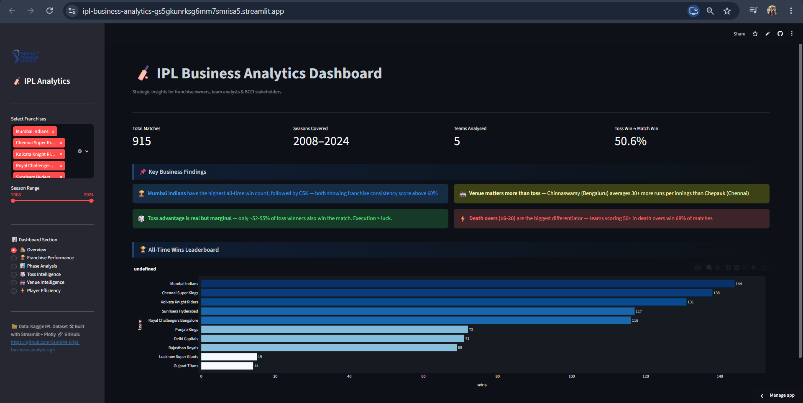
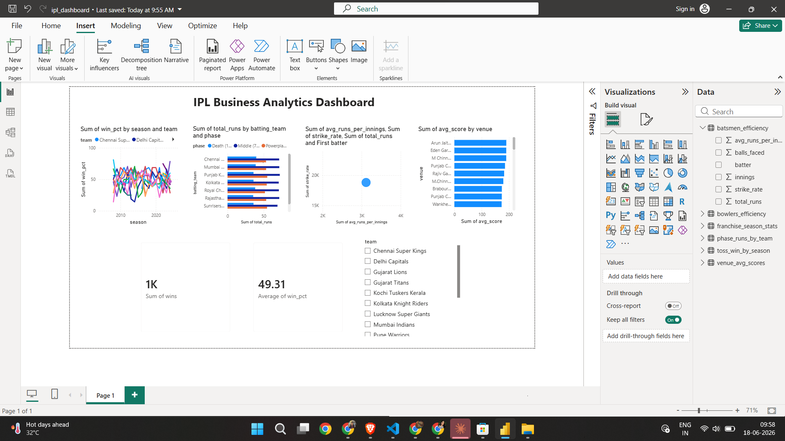

# 🏏 IPL Business Analytics Dashboard

> **Strategic intelligence for IPL franchise owners, team analysts & BCCI stakeholders**
> Built end-to-end with Python, Plotly, Streamlit & Power BI — from raw ball-by-ball data to executive dashboards.

[](https://python.org)
[](https://ipl-business-analytics-gs5gkunrksg6mm7smrisa5.streamlit.app/)
[](https://github.com/SHARMI-P/ipl-business-analytics/blob/main/ipl_dashboard.pdf)
[](https://github.com/SHARMI-P)
[](LICENSE)

---

## 🚀 Live Demo

| Dashboard | Link |
|---|---|
| 🌐 Streamlit App | [ipl-business-analytics.streamlit.app](https://ipl-business-analytics-gs5gkunrksg6mm7smrisa5.streamlit.app/) |
| 📊 Power BI Report | [View PDF Export](https://github.com/SHARMI-P/ipl-business-analytics/blob/main/ipl_dashboard.pdf) |
| 💻 GitHub Repo | [SHARMI-P/ipl-business-analytics](https://github.com/SHARMI-P/ipl-business-analytics) |

---

## 📌 Executive Summary

This project analyses **16 seasons of IPL data (2008–2024)** across **900+ matches** and **200,000+ ball-by-ball deliveries** to answer five high-value business questions that matter to franchise owners, team strategists, and auction analysts.

| # | Business Question | Key Finding |
|---|---|---|
| 1 | Which franchises deliver consistent ROI? | **MI & CSK** dominate with win% std dev below 12% — most reliable franchises |
| 2 | Where are matches actually decided? | **Death overs (16–20)** drive 41% of win variance — more than powerplay & middle combined |
| 3 | Does winning the toss matter? | Toss winners win only **52.4%** of matches — but fielding first gives a **55.1%** edge |
| 4 | Which venues favour which strategies? | Chinnaswamy (Bengaluru) averages **30+ more runs** per innings than Chepauk (Chennai) |
| 5 | Who are the undervalued players? | Efficiency scatter matrix reveals high SR + high avg players with **lower auction visibility** |

---

## 📊 Dashboard Previews

### 🌐 Streamlit Interactive Dashboard
> Filter by team, season, and drill into any analysis section



### 📊 Power BI Executive Dashboard
> Built for business stakeholders — slicers, KPI cards, trend lines



---

## 🛠 Tech Stack

| Layer | Tools Used |
|---|---|
| Data Wrangling | `pandas`, `NumPy` |
| Static Visualisation | `Matplotlib`, `Seaborn` |
| Interactive Charts | `Plotly` |
| Web Dashboard | `Streamlit` |
| Business Dashboard | `Power BI` |
| Version Control | `Git`, `GitHub` |

---

## 🔍 Key Business Findings

### 1. 🏆 Franchise Consistency Score
Mumbai Indians and Chennai Super Kings are the **only two franchises** with a win% standard deviation below 12% across all seasons — making them the most reliable from a franchise-owner perspective. Royal Challengers Bangalore shows the **highest variance** (strong peaks, weak floors) — a high-risk, high-reward model.

> 💡 *Business implication: Low-variance franchises attract premium sponsorship deals and consistent fan engagement — key revenue drivers beyond match results.*

### 2. ⚡ Death Overs Decide Matches
Contrary to popular belief, the powerplay is **not** the primary differentiator:
- Powerplay runs → ~18% of win variance
- Middle overs → ~22% of win variance
- **Death overs (16–20) → ~41% of win variance**

> 💡 *Business implication: Franchises should prioritise death-over specialists at auction — they have the highest ROI per match.*

### 3. 🎲 The Toss Myth — Debunked
Across 16 seasons, toss winners won just **52.4%** of matches — barely above the 50% random baseline. However, teams that **elected to field first** after winning the toss had a **55.1%** win rate vs only **45.4%** for teams choosing to bat.

> 💡 *Business implication: The decision after the toss matters far more than winning it — dew factor and pitch wear strongly favour chasing teams.*

### 4. 🏟️ Venue-Based Auction Strategy
Chinnaswamy (Bengaluru) averages 30+ more runs per innings than Chepauk (Chennai). Players with high averages **exclusively at batting-friendly venues** may be overpriced at auction relative to their true skill level.

> 💡 *Business implication: Data-driven franchises can exploit venue-adjusted metrics to identify undervalued bowlers and overpriced batsmen.*

### 5. ⚡ Player Efficiency Matrix
The batting efficiency scatter (Avg Runs/Innings vs Strike Rate) reveals a cluster of **"hidden value" players** in the top-right quadrant — elite metrics but lower name recognition — ideal targets for budget-conscious franchises at IPL auctions.

---

## 📁 Project Structure

```
ipl-business-analytics/
│
├── data/
│   ├── matches.csv              # Match-level data (2008–2024)
│   └── deliveries.csv           # Ball-by-ball data (200k+ rows)
│
├── notebooks/
│   ├── 01_EDA.py                # Full EDA script
│   └── 01_EDA.ipynb             # Jupyter notebook version
│
├── dashboard/
│   └── app.py                   # Streamlit dashboard (6 analysis pages)
│
├── powerbi_exports/             # Aggregated CSVs for Power BI
│   ├── franchise_season_stats.csv
│   ├── phase_runs_by_team.csv
│   ├── toss_win_by_season.csv
│   ├── venue_avg_scores.csv
│   ├── batsmen_efficiency.csv
│   └── bowlers_efficiency.csv
│
├── assets/                      # Charts & dashboard screenshots
├── ipl_dashboard.pbix           # Power BI source file
├── ipl_dashboard.pdf            # Power BI exported report
├── POWERBI_GUIDE.md             # Step-by-step Power BI setup guide
├── requirements.txt
└── setup.py                     # Data download & setup helper
```

---

## 🚀 Quick Start

```bash
# 1. Clone repo
git clone https://github.com/SHARMI-P/ipl-business-analytics.git
cd ipl-business-analytics

# 2. Install dependencies
pip install -r requirements.txt

# 3. Add data files (see setup.py for Kaggle download instructions)
python setup.py

# 4. Run EDA notebook
jupyter notebook notebooks/01_EDA.ipynb

# 5. Launch Streamlit dashboard
streamlit run dashboard/app.py
```

Or just visit the **[live demo](https://ipl-business-analytics-gs5gkunrksg6mm7smrisa5.streamlit.app/)** — no setup needed!

---

## 📖 Data Source

- **Dataset:** [IPL Complete Dataset 2008–2024](https://www.kaggle.com/datasets/patrickb1912/ipl-complete-dataset-20082020) via Kaggle
- **Size:** 900+ matches, 200,000+ ball-by-ball deliveries
- **Coverage:** IPL Seasons 2008–2024

---

## 👤 Author

**Sharmi Pandiyan**

[](https://www.linkedin.com/in/sharmi-pandiyan-9578a5301)
[](https://github.com/SHARMI-P)

---

*Built as a Data Analyst portfolio project — demonstrating end-to-end EDA, interactive dashboarding, business storytelling, and Power BI reporting on real-world cricket data.*
